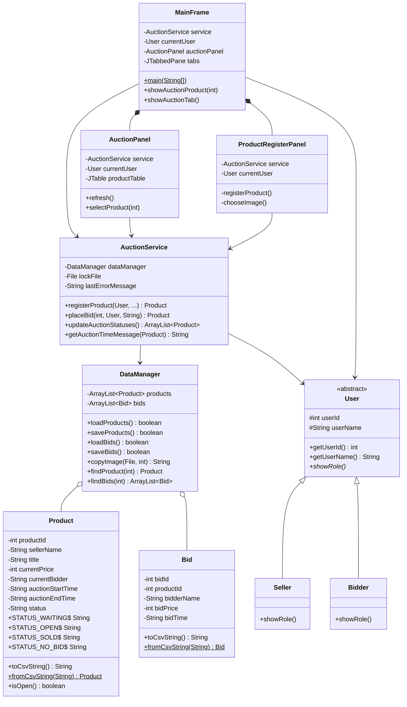

# 교내 경매 프로그램 클래스 구조

기능과 필수 객체지향 개념을 유지하면서 총 10개 클래스로 단순화한 구조입니다.

## 패키지 구조

```text
src
└── auction
    ├── MainFrame.java
    │
    ├── model
    │   ├── User.java
    │   ├── Seller.java
    │   ├── Bidder.java
    │   ├── Product.java
    │   └── Bid.java
    │
    ├── file
    │   └── DataManager.java
    │
    ├── service
    │   └── AuctionService.java
    │
    └── gui
        ├── AuctionPanel.java
        └── ProductRegisterPanel.java
```

## 클래스 구조도



## 역할별 처리 흐름

```text
MainFrame
├── 경매 참여 탭: AuctionPanel
└── 상품 등록 탭: ProductRegisterPanel

Swing 화면
    ↓
AuctionService
    ↓
DataManager
    ↓
products.csv / bids.csv / images
```

## 오류 처리 방식

```java
Product result = service.placeBid(
        productId,
        currentUser,
        priceText
);

if (result == null) {
    JOptionPane.showMessageDialog(
            this,
            service.getLastErrorMessage()
    );
}
```

- 성공하면 객체 또는 `true`를 반환합니다.
- 실패하면 `null` 또는 `false`를 반환합니다.
- 실패 이유는 `getLastErrorMessage()`로 확인합니다.
